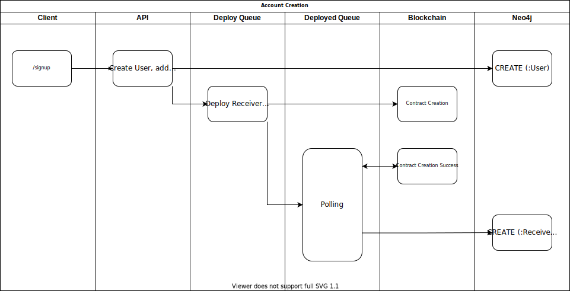
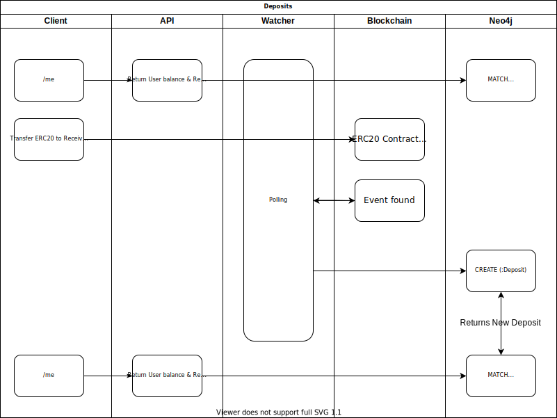
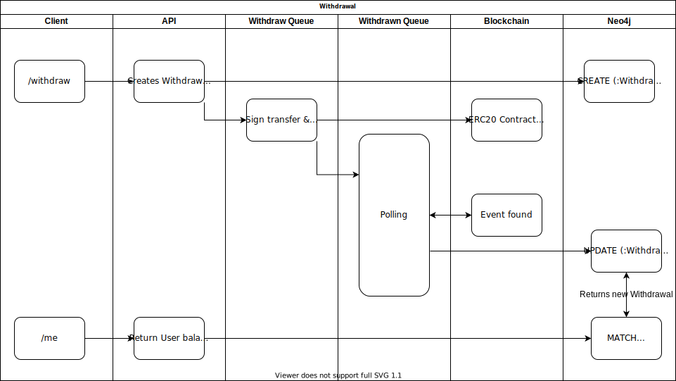
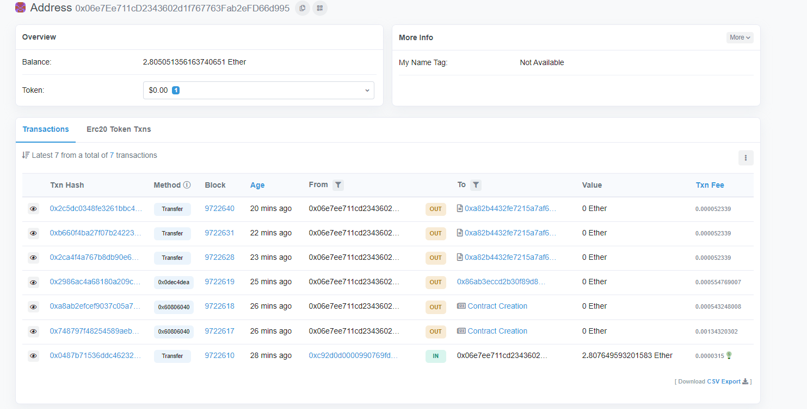

# centralized-eth-erc20-payments

Centralized Ethereum ERC20 Payment Processor

## What is it ?

Ever wondered how crypto exchanges manage deposits and withdrawals ? This project aims to demonstrate how to do user management, handle deposits and withdrawals plus keep track of each users balance in a centralized store.

## Why centralized ?

This is a great question! The movement of blockchain is all about decentralization, transparency and accountability and thus putting the term 'centralized' in here seems to negate the incentives. However, there are many use cases to centrally keep track of a 'Users Balance' and the first, for example, is an exchange - Users deposit funds and then use the funds to buy and sell, this is of course talking about a centralized exchange. Then you have centralized investment accounts such as; [Nexo](https://nexo.io) & [Celsius](https://celsius.network/). Another example is if you were to make a game and accept a deposit of crypto to 'Top Up' a users virtual balance. Finally, you might be [Tesla](https://www.tesla.com/en_gb) and wanting to accept crypto payments.

Other examples are:

1. Paying mortgage
2. Paying Taxes
3. Topping up gambling account
4. Paying for goods in a store

With the current blockchain ecosystem still lacking; adoption, age and technological adaptors, the listed reasons in the paragraph above are difficult to implement with pure decentralization. Using pure blockchain tech would mean your users will have to change their current way of interacting with your app. Right now if I wanted to deposit [USDT](https://tether.to/) into an exchange or an investment account I would be presented with an address, where I could simply send the funds however I see fit. Here are two examples of being presented with an address:

### Coinbase Pro Deposit

https://pro.coinbase.com/

<p align="center" width="100%">
    
</p>

### Nexo Deposit

https://nexo.io

<p align="center" width="100%">
    
</p>

Presenting your users with an address, like demonstrated, allows for the greatest flexibility when it comes to paying for whatever service you have to offer. Most of the common Joe, who hold crypto, will hold crypto in an exchange, and so presenting them with an address means they can simply copy the address, use their exchanges mechanism to send the funds. This process is usually a straightforward one and feels, to the user, like a normal bank payment. Without presenting your users with their own unique address to deposit, like the two above, you would only have one other option - Expect your users to interact with a decentralized application, this would require your users to use an unfamiliar tool such as metamask:

https://metamask.io/

> Note that using Metamask as an example here is not shedding any bad light on it! Metamask is a great tool and helps users interact with decentralized applications with ease. The point that's being expressed is - Its different from what most users are used to and would require users to transferer funds to their Metamask wallet before interacting with your app thus using extra gas.

<p align="center" width="100%">
    
</p>

Finally, this way of accepting payments means you can use the code in this project to easily implement a crypto currency payment gateway into your project without moving lots of your infrastructure onto the blockchain.

## How does it work ?

> ⚠ The Payment Processor doesn't actually store 'Users Balance' however its an aggregation of the deposits, withdrawals and associated fees.

### Account Creation

When a user creates an account, a message is placed onto the [Receiver Deploy Queue](./src/receiver/deploy.js), the queue listener will deploy a [Receiver Contract](./src/contracts/contracts/Receiver.sol) associated with that user. On deployment transaction receipt another message is placed on the [Receiver Deployed Queue](./src/receiver/deployed.js) where the listener will watch and wait for the confirmation of the contract deployment. On confirmation, the deployed listener will update Neo4j associating the receiver address to the new user. Each Receiver is designed to accept [ERC20 USDT](https://tether.to/) token and is a child of/created by the [Bank Contract](./src/contracts/contracts/Bank.sol).

> This approach means that you are spending gas each time a user signs up, this is because of the `Receiver` contract deployment. You will have to at some point spend this gas to receive funds the way described in this project, however, you may want to delay the deployment of the contract until your user has passed some form of verification such as [KYC](https://www.fool.com/the-ascent/cryptocurrency/articles/what-is-kyc-and-why-do-crypto-exchanges-require-it/).



### Deposits

When the [Receiver Contract](./src/contracts/contracts/Receiver.sol) is deployed the user will be able to query for there deposit address and deposit funds. The [Watcher](./src/watcher/index.js) watches the `Transfer` logs for the [ERC20 USDT](https://tether.to/) token, reconciles the sender address to an associated Receiver contract and then is able to relate a deposit to a user, thus updating the users balance.

<p align="center" width="100%">
    
</p>

### Withdrawals

When a user requests a withdrawal a 'Withdrawal Request' is placed on the [Withdraw Queue](./src/withdraw/withdrawn.js) queue. On withdraw transaction receipt another message is placed on the [Withdrawn Queue](./src/withdrawer/withdrawn.js) where the listener will watch and wait for the confirmation of the withdraw transaction. On transaction success, the listener shall append a deposit against the User.

> This method of withdrawals means that you owner will be paying gas each time a withdrawal happens, you may, for example, want to deduct some tokens from your user on withdrawal to maintain profitability.



## Modules

The server consists of following modules:

1. [API](./src/api) - User facing REST, handles account creation and withdrawal requests.
2. [Receiver](./src/receiver) - Listens for account creation and deploys the [Receiver Contract](./src/contracts/contracts/Receiver.sol) and associates the deployed contract with the new User.
3. [Withdrawer](./src/watcher) - Listens for withdrawal requests and facilitates the transaction.
4. [Watcher](./src/watcher) - Watches the [USDT Transfer](https://github.com/OpenZeppelin/openzeppelin-contracts/blob/master/contracts/token/ERC20/IERC20.sol#L75) logs and records a deposit if the 'to' address is one belonging to a User.

## Dependencies

This project uses the following:

1. [Neo4j](https://neo4j.com/) - For account storage, keeping track of deposits and withdrawals and use to query and aggregate the users total balance.
2. [Redis](https://redis.com/) - Used as a queue for handling the Deployment of each users [Forwarder]() contract and each withdrawal request.
3. [Ganache](https://www.trufflesuite.com/ganache) - Used as a development blockchain for testing

## Data Model

High level overview of whats stored in [Neo4j](https://neo4j.com/):


## Development

```bash
npm run docker-dev
```

## Testing

### Using Docker

```bash
npm run docker-test
```

### Against Rinkeby

The [e2e](./test/e2e/deposit-and-withdraw.test.js) tests gave successfully ran against the [Rinkeby test network](https://www.rinkeby.io/#stats). The acting address was [0x06e7Ee711cD2343602d1f767763Fab2eFD66d995](https://rinkeby.etherscan.io/address/0x06e7ee711cd2343602d1f767763fab2efd66d995).



**From the bottom up the transactions are as follows:**

1. Update account with ETH to preform the tests
2. Deploy [Bank Contract](./src/contracts/contracts/Bank.sol)
3. Deploy [Test ERC20 Contract](./src/contracts/contracts/TestERC20.sol)
4. Deploy [Receiver Contract](./src/contracts/contracts/Receiver.sol) - Happens on account creation
5. Top up Bank Contract with Test ERC20
6. Deposit Funds into Receiver contract
7. Withdraw Funds from the Bank contract

After running the test this Cypher was executed:

```cypher
MATCH (bank:Bank)

RETURN bank {
    .*,
    transaction: head([(bank)-[:HAS_TRANSACTION]->(bT:Transaction) | bT {.*}]),
    receivers: [
        (bank)-[:HAS_RECEIVER]->(receiver:Receiver) | receiver {
            .*,
            transaction: head([(receiver)-[:HAS_TRANSACTION]->(rT:Transaction) | rT {.*}]),
            user: head([(receiver)<-[:HAS_RECEIVER]-(user:User) | user {
                .*,
                deposits: [(receiver)-[:HAS_DEPOSIT]->(deposits:Deposit) | deposits {
                    .*,
                    transaction: head([(deposits)-[:HAS_TRANSACTION]->(dT:Transaction) | dT {.*}])
                }],
                withdrawals: [(user)-[:HAS_WITHDRAWAL]->(withdrawals:Withdrawal) | withdrawals {
                    .*,
                    transaction: head([(withdrawals)-[:HAS_TRANSACTION]->(wT:Transaction) | wT {.*}])
                }]
            }])
        }
    ]
} AS bank
```

And returned the following data:

```json
{
  "id": "47524487-f5b4-4581-9a92-d730f4966535",
  "address": "0x86AB3eCcd2B30F89d870bFC14678938cA65bB22e",
  "uptoDateWithBlockNumber": 9722654,
  "receivers": [
    {
      "id": "804807eb-a327-4f0c-803e-94f65ee04acf",
      "address": "0x794664a78ABA698213f7E5c9c6037bfB33dE60c1",
      "user": {
        "email": "Destiney90@hotmail.com",
        "id": "94da63ed-a185-49d6-a207-223c12b52d37",
        "password": "$2b$10$Cn6qpp289BSVfvcwbFAej.6q61qvt3IGPdmzW5e5aYI1Rb5I8RO2q",
        "createdAt": "2021-11-28T18:04:17.962000000Z",
        "deposits": [
          {
            "id": "7967e8a0-dc10-47dd-87f8-a09d73758ecf",
            "amount": 100,
            "transaction": {
              "cumulativeGasUsed": 5087220,
              "blockHash": "0xa0cc4179777bc731ed1ced65cb7569aba25bfc69ee1f5822068d5b3caaba9ae8",
              "id": "06f5c4a4-186c-43c4-83ab-f4e883eccce3",
              "blockNumber": 9722628,
              "gasUsed": 52339,
              "transactionIndex": 22,
              "transactionHash": "0x2ca4f4a767b8db90e630213d9a99459b9741bf9b3ab2fc8de5880ae1ec615d6b"
            }
          }
        ],
        "withdrawals": [
          {
            "id": "1979925b-bfa7-493b-b85c-0755d413c423",
            "amount": 100,
            "to": "0x0a4a48dda1f4c2ba55e7fa227a745cd509f807ed",
            "completed": true,
            "transaction": {
              "cumulativeGasUsed": 17918411,
              "blockHash": "0xe45d62c267abd8c11bcb700ee69e52321736edd0569b51dc51ff82649d1f307f",
              "gasPrice": 1000000010,
              "id": "4c5596c1-0a20-4b7c-9b98-7762e7e5c693",
              "blockNumber": 9722640,
              "gasUsed": 52339,
              "transactionIndex": 23,
              "transactionHash": "0x2c5dc0348fe3261bbc4131285cdb9249c692c238a5a17b549b0d96689c62bc84"
            }
          }
        ]
      },
      "transaction": {
        "cumulativeGasUsed": 2114076,
        "blockHash": "0xff77b32b584642f0c2fe8490a11865508d283d5a6be077b687ba6d8e22add90b",
        "gasPrice": 1000000014,
        "id": "b781da2b-f4a4-4ec7-8818-a2cd90a0118f",
        "blockNumber": 9722619,
        "gasUsed": 554769,
        "transactionIndex": 17,
        "transactionHash": "0x2986ac4a68180a209cb37a8812c957edaa57f4aedbbfe445ee07946cc7344e8e"
      }
    }
  ],
  "transaction": {
    "cumulativeGasUsed": 3263997,
    "blockHash": "0xce62bbb9a1c82457c9c8e56c71e0d6278edb996f67d34e5aeba4160c841fcabb",
    "gasPrice": 1000000015,
    "id": "e139a8eb-f1eb-4d8d-b982-43b46beb4ffe",
    "blockNumber": 9722617,
    "gasUsed": 1343203,
    "transactionIndex": 25,
    "transactionHash": "0x748797f48254589aeba8306e3bd4e9cd3aa06c97f43c712930f15363b1f00b9e"
  }
}
```

## License

MIT Daniel Starns danielstarns@hotmail.com
