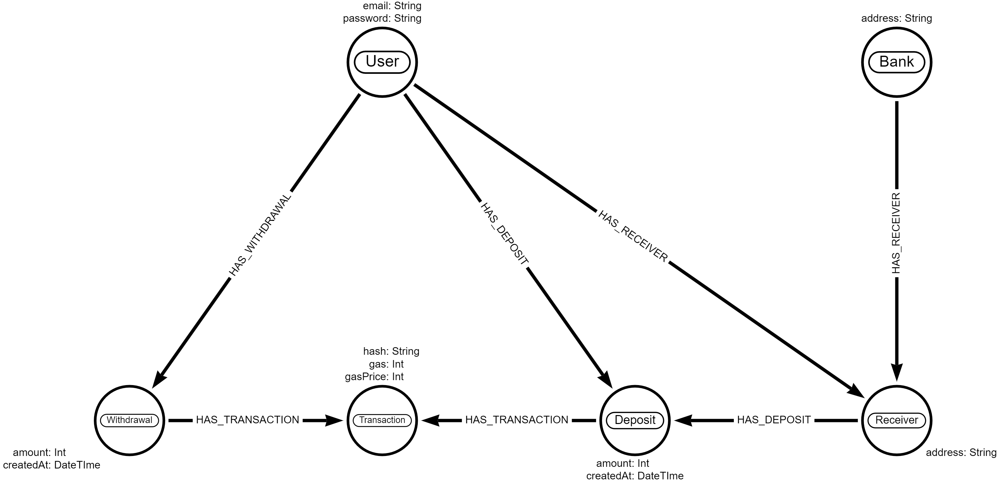

# centralized-eth-payments

Centralized Ethereum Payment Processor

## What is it ?

Ever wondered how crypto exchanges manage deposits and withdrawals ? This project aims to demonstrate how to do user management, handle deposits and withdrawals plus keep track of each users balance in a centralized store.

## How does it work ?

> ⚠ The Payment Processor doesn't actually store 'Users Balance' however its an aggregation of the deposits, withdrawals and associated fees.

### Account Creation

When a user creates an account, a message is placed onto the [Deployer]() queue, the Deployer will create a [Forwarder]() contract associated with that User. The [Forwarder]() is designed to accept ERC20 USDT token and forward the deposited funds onto a specified 'Master Wallet'.

### Deposits

When the [Forwarder]() contract is deployed the user will be able to query for there deposit address and deposit funds. The [Watcher]() watches forwarded transactions incoming to the 'Master Wallet', reconciles the sender address to an associated user and updates users balance.

### Withdrawals

When a user requests a withdrawal a 'Withdrawal Request' is placed on the [Withdrawer]() queue. The Withdrawer queue shall listen for withdrawal requests and shall facilitate the transaction plus update the users balance.

## Services

The project consists of following Node.js services deployed independently:

1. [API]() - User facing REST, handles account creation and withdrawal requests.
2. [Deployer]() - Listens for account creation and deploys the [Forwarder]() contract and associates the deployed contract with the new User.
3. [Withdrawer]() - Listens for withdrawal requests and facilitates the transaction.
4. [Watcher]() - Watches for the [USDT Transfer](https://github.com/OpenZeppelin/openzeppelin-contracts/blob/master/contracts/token/ERC20/IERC20.sol#L75) event where the `to` address is the 'Master Wallet' and reconciles, via a Forwarder, the sender to an associated user.

## Dependencies

This project uses the following:

1. [Neo4j]() - For account storage, keeping track of deposits and withdrawals and use to query and aggregate the users total balance.
2. [Redis]() - Used as a queue for handling the Deployment of each users [Forwarder]() contract and each withdrawal request.
3. [Ganache]() - Used as a development blockchain for testing

## Data Model

High level overview of whats stored in [Neo4j]():



## Development

For starting services manually check each services README.md. Otherwise use Docker 🐳:

```bash
npm run docker-dev
```

## Testing

```bash
npm run docker-test
```

## Licence

MIT Daniel Starns danielstarns@hotmail.com
